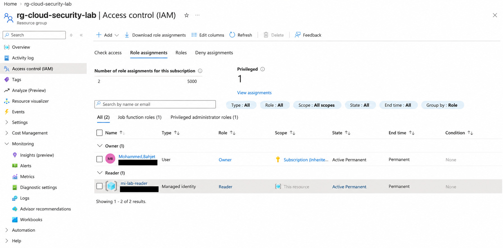
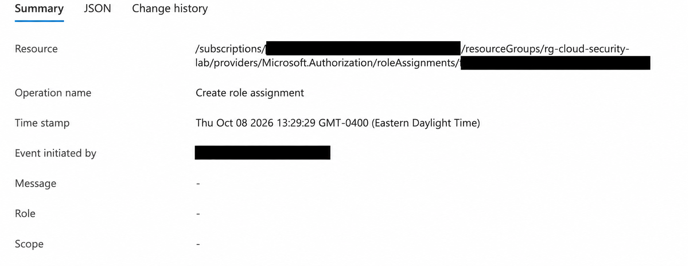

# azure-network-security-iam-lab
Azure networking, NSG SSH restrictions, managed identity RBAC, and activity-log auditing lab.
## Screenshots

### Resource inventory
![R)

### Inbound security rules

### Subnet association

### Reader role assignment

### Activity log

